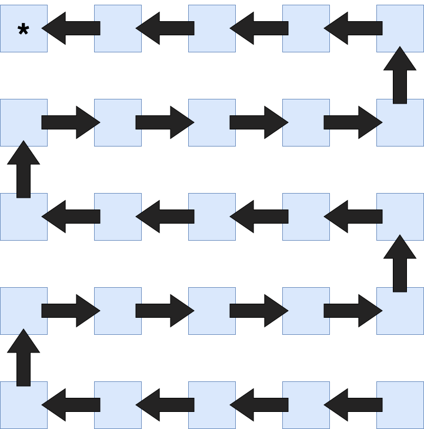
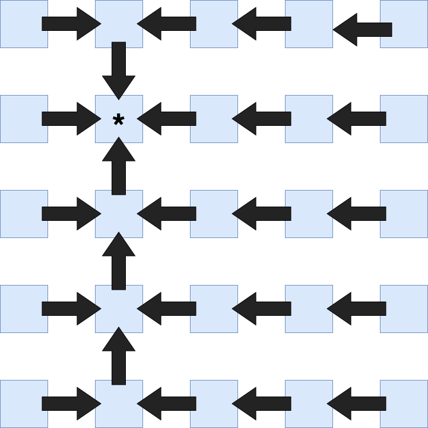

# Layouts

When using Collective Reduce functions two different communication schemas / layouts can be used.

## Usage

To choose the layout the `algorithm` flag can be set to
```
algorithm = grid
or
algorithm = snake
or
algorithm = auto
```
A schematic example for both the snake and grid layout can be found below. Currently `auto` chooses the grid algorithm. The snake algorithm can only be choosen if the root of the reduce is in one of the 4 corners of the communication grid the reduce is defined on. For large arrays snake will maximize throughput while for short arrays grid will minimize latency.

## Definitions

Below are schematics to understand the logic of the snake and grid pattern. The root of the reduce is marked with a star `*`.

### Snake

The snake pattern currently only works with the root in one of the four corners. It then puts all the PEs on a string favoring horizontal communication.



### Grid

The grid pattern works with the root in every PE. The first reduction is horizontally and the second one is vertically.

